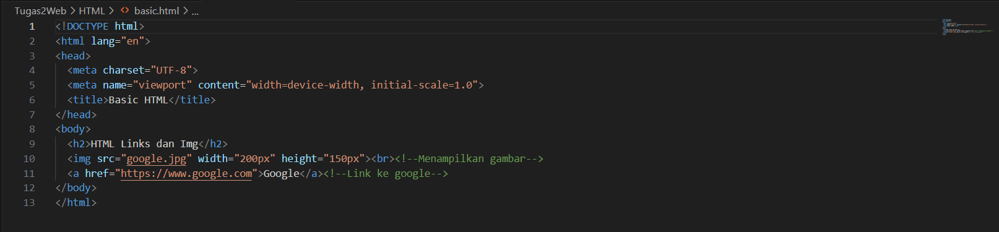
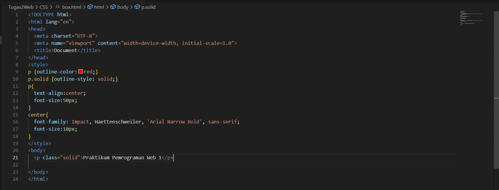
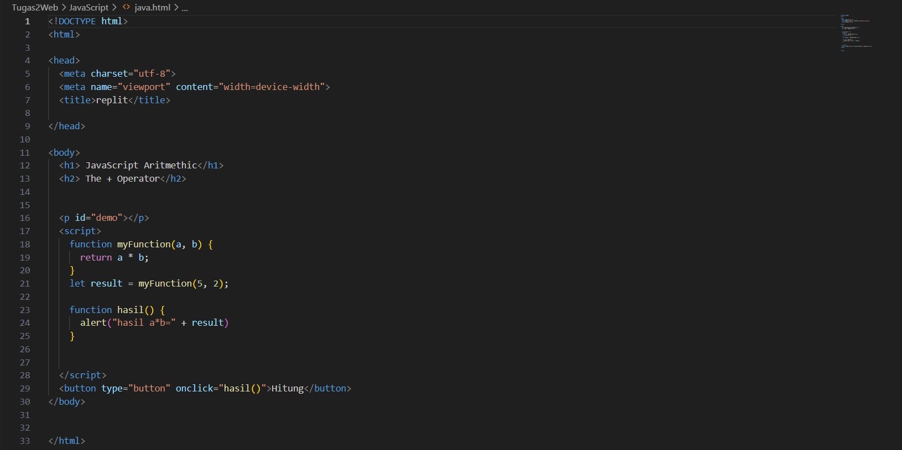

# Laporan Praktikum pemrograman Web 1
Pada praktikum pemrograman web I mempelajari HTML, CSS dan JavaScript.

## Identitas Diri
Nama    : Amel Adellia Fahrani

NIM     : 230102026

Kelas   : TI-1B

## HTML

## 
1. HTML (HyperText Markup Language) adalah bahasa markup standar untuk halaman web.
- Terdapat bebrapa element dalam HTML yaitu : DOCTYPE html untuk mendefinisikan bahwa dokumen tersebut adalah dokument html, head berisi informasi mengenai halaman html, title menentukan judul untuk halaman html di tab browser, body mendefinisikan isi dokumen, h1 untuk menuliskan judul besar dan p untuk menulis paragraph.
- HTML Links. Atribut akan memberikan informasi tambahan tentang element seperti a href untuk mendefinisikan hyperlink yang menunjukkan tujuan link tujuan.
- Image HTML. Kita dapat meningkatkan desai dan tampilan halaman web dengan menambahkan gambar, yakni dengan img src untuk menampilkan gambar, serta width dan height untuk menentukan lebar dan tinggi gambar.
- List digunakan untuk mengelompokan sekumpulan item.ul untuk daftar yang tidak berurutan, ol untuk daftar yang diurutkan dan setiap item daftar dimulai dengan li.
- Tabel html. Digunakan untuk mengatur data pada baris dan kolom.table untuk mendefinisikan table, td singkatan table data sesuatu didalam sini adalah isi dari table,tr singkatan dari table row untuk membuat baris table, th singkatan dari table header. Teks dalam th akan dicetak tebal, colspan digunakan untuk menggabungkan beberapa kolom, rowspan digunakan untuk menggabungkan beberapa baris.
- HTML favikon adalah gambar kecil yang ditampilkan di sebelah judul halaman di tab browser.

## CSS

## 
2. CSS adalah singkatan dari Cascading Style Sheet, CSS menjelaskan bagaimana elemen html ditampilkan dilayar, dan mengontrol tata letak halaman web.
- Selectors CSS digunakan untuk memilih elemen HTML yang ingin diberikan style. Memilih elemen HTML berdasarkan nama elemen missal p, berarti semua elemen p akan dikenakan style, memilih menggunakan id misal #contoh1, Id digunakan untuk memilih satu element yang unik, untuk memilih elemen dengan kelas tertentu bisa menuliskan karakter (.) dan diikuti nama kelas.
- Model kotak CSS adalah sebuah kotak yang membungkus setiap elemen HTML. Terdiri dari: konten, padding, batas dan margin.
- Outline yaitu garis yang tergambar di sekeliling elemen. misalnya dotted-mendefinisikan garis putus-putus, solid-mendefinisikan garis besar, double-mendefinisikan garis besar ganda.
- CSS Table. Seteleh membuat table pada html kita bisa meningkatkannya menggunakan CSS. Gunakan border property untuk menentukan batas table, width:100% untuk menmpilkan table satu layar penuh, border-collapse untuk mengubah batas table menjadi satu batas saja, dan hover untuk memberikan warna pada table ketika kusor diarahkan ke table.

    
## JavaScript

## 
3. JavaScript adalah Bahasa pemrograman web dan merupakan Bahasa script default dalam html.
- Function adalah blok kode yang dirancang untuk melakukan tugas tertentu. Saat dijalankan ketika "sesuatu" memanggilnya (memanggilnya),return untuk keluar dari fungsi
- If, else dan if else. if digunakan untuk menentukan blok kode yang akan dieksekusi jika kondisinya benar, else digunakan untuk menentukan blok kode yang akan dieksekusi jika kondisinya salah, gunakan else if untuk menentukan kondisi baru jika kosndisi pertama salah.
- Switch digunakan untuk melakukan tindakan berbeda berdasarkan kondisi berbeda. Gunakan switch untuk memilih salah satu dari blok kode yang akan dieksekusi. Dalam setiap case pada switch terdapat break yang berarti menghentikan eksekusi di dalam case.
- Loop. Perulangan digunakan untuk menjalankan kode yang sama berulang kali, setiap kali dengan nilai yang berbeda.for-mengukang kode beberapa kali, for-in menelusuri suatu objek, for-of mengulang objek yang dapat diubah, while-mengulang kode selama kondisi yang ditentukan benar, do-while sama seperti while.
- Aritmatika + untuk penjumlahan, 
-untuk pengurangan, * untuk perkalian, ** untuk eksponisial, / untuk pembagian, % untuk modulus, ++  increment dan --untuk decrement

